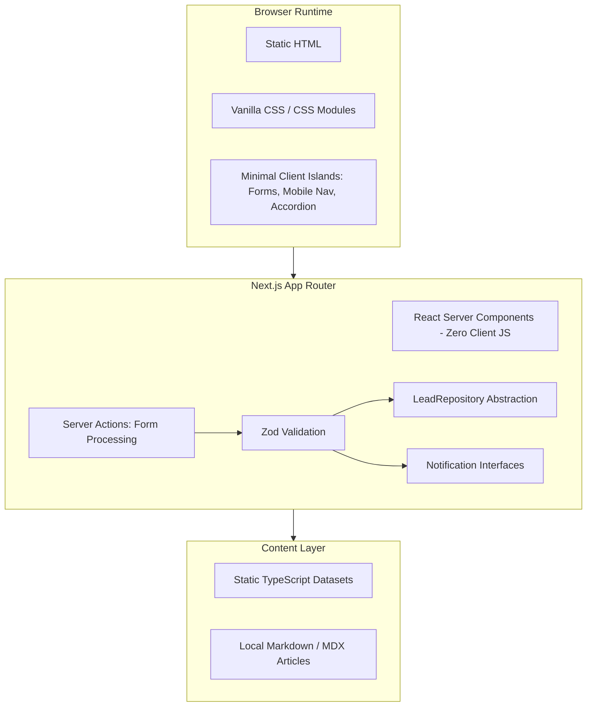
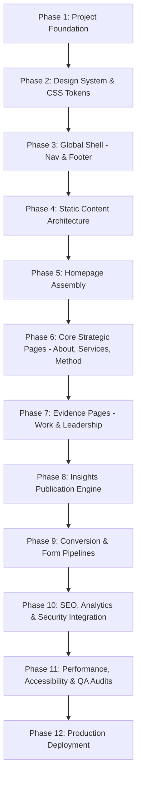

# THINKINGHEAD NIGERIA LIMITED — CORPORATE WEBSITE
## Technical Architecture & Implementation Blueprint (Validated Architecture Phase)

---

### Document Information & Control
* **Client / Organization:** ThinkingHead Nigeria Limited (RC 8611016)
* **Registered Address:** 5 Pipeline Road, Bayan Dutse, Kaduna, Nigeria
* **Contact Information:** `hello@thinkinghead.ng` · `thinkingheadng@gmail.com` · `+234 706 834 9172`
* **Lead Frontend Engineer & Technical Architect:** Antigravity AI
* **Date:** October 2026
* **Status:** Architecture Validated — Ready for Implementation Initialization
* **Authoritative Source Documents:**
  1. `docs/THL_Digital_Expression_BRD.pdf` (*Digital Expression Business Requirements Document & Page Content Architecture*, Version 2.0, September 2026)
  2. `docs/THL_Website_BRD.pdf` (*Website Business Requirements Document & Page Content Specification*, Version 1.0, September 2026)

---

## 1. Architecture Decision Summary

This blueprint defines the validated technical architecture for the ThinkingHead Nigeria Limited corporate website. 

The website expresses ThinkingHead's institutional identity across **Four Layers**:
* **Layer 1: What We Believe** (Worldview, institutional philosophy, operating principles).
* **Layer 2: How We Think** (Eight-step diagnostic and execution methodology).
* **Layer 3: What We Have Built** (Evidence of delivery, signature projects, case studies).
* **Layer 4: What We Know** (Intellectual capital: research notes, frameworks, perspectives).

### Architectural Posture:
1. **Static-First Performance:** Built on **Next.js (App Router)** utilizing React Server Components (RSC) and static site generation (SSG). Content is pre-rendered at build time to provide near-instant page transitions, zero client-side JavaScript for static sections, and resilience under poor connectivity.
2. **Minimalist, Bloat-Free Styling:** Crafted using **CSS Modules / Vanilla CSS** linked to strict CSS design tokens. No heavyweight UI frameworks or CSS utility runtimes that could degrade page load or introduce package fragility.
3. **Extensible, Decoupled Content Layer:** Fixed corporate content is modeled as strongly typed TypeScript datasets; evolving intellectual capital (Insights) is managed via local Markdown/MDX with frontmatter. The data-access layer is decoupled behind clean retrieval functions so a headless CMS can be introduced in the future without requiring UI refactoring.
4. **Pluggable Integration Abstractions:** Lead storage, WhatsApp alerts, transactional email dispatch, and rate limiting are architected through abstract interfaces. No unapproved database, paid rate-limiting provider, or proprietary notification service is hardcoded into the application.
5. **Operating Context Engineering:** Designed specifically to perform seamlessly on a 3-year-old Android mobile device on a 3G network in Nigeria (<500 KB total page weight budget).

---

## 2. Corrected Requirements Interpretation

To maintain strict fidelity to the source documents, the following points clarify the boundary between **Documented BRD Requirements** and **Engineering Implementation Decisions**:

### 2.1 Database and CMS Interpretation
* **Documented BRD Position:**
  * Neither BRD mandates a relational or document database.
  * The Website BRD explicitly states: *"Recommended: static site (Next.js or Astro) deployed to Vercel or Cloudflare Pages. Content changes are infrequent and can go through a simple markdown/JSON content layer. No WordPress... Maintenance: Content updates via Git commits or a lightweight headless CMS (Contentlayer, Sanity, or Keystatic)."*
* **Corrected Architectural Position:**
  * Databases and CMS solutions are **not prohibited**; they are simply **not required for the MVP**.
  * Introducing PostgreSQL, MongoDB, Prisma, or a hosted CMS SaaS (Sanity/Contentful) at this stage would introduce unneeded infrastructure, latency, maintenance overhead, and recurring costs without any documented functional justification.
  * The implementation will use local static TypeScript and Markdown/MDX. However, the data fetching layer will be isolated behind clean interfaces (`getPublishedInsights()`, `getInsightBySlug()`). If the business later approves a CMS, only the data retrieval implementation will change—the components, templates, and styling will remain untouched.

### 2.2 Lead Processing and Storage Interpretation
* **Documented BRD Position:**
  * FR-01 states: *"Submit triggers email to thinkingheadng@gmail.com + WhatsApp notification [v1.0 also notes Slack]. Confirmation: 'We've received your message. You'll hear from Ben within 24 hours.'"*
  * FR-02 states: *"Lead data stored and forwarded."*
  * Neither document specifies an approved database, CRM, spreadsheet, or storage provider.
* **Corrected Architectural Position:**
  * The architecture **must not prematurely select or hardcode** a persistence provider (such as Supabase, Airtable, Google Sheets, or edge KV).
  * Lead processing is split into two independent architectural concerns:
    1. **Immediate Notification:** Forwarding lead details via email to `thinkingheadng@gmail.com` and dispatching operational alerts.
    2. **Persistent Storage:** Abstracted via a `LeadRepository` interface. In development and staging, a local mock/logging repository will be used until the business owner explicitly approves a persistent storage destination.

### 2.3 WhatsApp and Alert Notification Interpretation
* **Documented BRD Position:**
  * FR-01 requires a WhatsApp notification sent to Ben Shekari upon form submission (v1.0 also mentioned Slack).
  * No provider (Twilio, Meta WhatsApp Cloud API, webhook relay) is specified.
* **Corrected Architectural Position:**
  * The architecture will define a provider-agnostic `WhatsAppNotifier` interface.
  * No specific third-party provider or API client library will be locked in until credentials and business preference are formally provided.
  * The application will not claim WhatsApp notification is functional until an approved provider is wired, configured, and verified.

### 2.4 Rate Limiting Interpretation
* **Documented BRD Position:**
  * FR-01 and FR-08 require form endpoints to be protected by a honeypot and rate limiting (no reCAPTCHA).
* **Corrected Architectural Position:**
  * In-memory rate limiting is not sufficient for a distributed serverless or edge production environment (where memory is not shared across ephemeral lambdas).
  * An abstract `RateLimiter` interface will be designed. During initial local development, a clean in-memory sliding-window limiter will satisfy development testing. For production, the implementation adapter will align with the final deployment target (e.g., Cloudflare Rate Limiting or Upstash Redis on Vercel) once approved.

### 2.5 Security Headers Interpretation
* **Documented BRD Position:**
  * FR-08 requires: *"HTTPS enforced. HSTS, CSP, X-Frame-Options headers. No third-party scripts except analytics. Form endpoint rate-limited."*
* **Corrected Architectural Position:**
  * Draft security headers from initial analysis are refined. Legacy headers such as `X-XSS-Protection` (deprecated by modern web standards and known to introduce vulnerabilities in older browsers) will be omitted in favor of a modern, tightly-scoped `Content-Security-Policy`.
  * The CSP will be constructed around the actual runtime dependencies of the application (self-hosted fonts, approved analytics domains, and embedded Google Maps). `unsafe-inline` will be eliminated wherever feasible.

### 2.6 Performance Targets vs. Engineering Hypotheses
* **Documented Targets (Strict Ground Truth):**
  * Lighthouse score: **95+** on Performance, Accessibility, Best Practices, and SEO (v2.0 requirement).
  * First Contentful Paint (FCP): **< 1.2s** on 4G / 3G mobile conditions (v2.0 requirement).
  * Total page weight: **< 500 KB** for any page (v2.0 requirement).
  * Images: WebP / AVIF, lazy-loaded, responsive `srcset`.
  * No hero videos, text-only hero, zero render-blocking animations.
* **Engineering Assumptions (To Be Verified, Not Pre-Claimed):**
  * Routing via West African edge POPs (Lagos/Johannesburg) is an infrastructure hypothesis dependent on the chosen CDN and DNS routing, not an accomplished fact.
  * Sub-50ms TTFB is an architectural aspiration that will only be claimed after real-world network measurement.

---

## 3. Final Technology Stack

The finalized technical stack represents the simplest, most performant combination that satisfies the BRD requirements:



| Technology | Purpose | Architectural Justification | BRD Alignment |
| :--- | :--- | :--- | :--- |
| **Next.js (App Router)** | Primary Web Framework | Provides React Server Components (RSC) and static site generation (SSG) by default. Ensures zero client-side JavaScript for marketing pages, ultra-fast initial paint, and integrated Server Actions. | Explicitly Recommended (FR-05, FR-07) |
| **React** | Component Model | Used strictly as the rendering engine for Next.js. Client components (`'use client'`) are strictly isolated to interactive islands (forms, mobile navigation drawer, method accordion). | Standard for Next.js |
| **TypeScript** | Type Safety | Enforces compile-time type verification across routes, static data, frontmatter metadata, and form actions. Eliminates runtime crashes. | Implementation Standard |
| **CSS Modules / Structured CSS** | Styling System | Guarantees zero JavaScript runtime overhead, scoped component styling, and perfect fidelity to the documented color palette and typography tokens. Avoids Tailwind versioning overhead. | System Architecture Requirement |
| **Local Markdown + `gray-matter`** | Insights Publishing | Clean, Git-backed file publishing for research notes, frameworks, and perspectives under `/insights`. No database or SaaS dependency required. | Explicitly Recommended (FR-03, FR-05, FR-07) |
| **Zod** | Server-Side Validation | Type-safe schema validation for form submissions on the server, ensuring strict data cleanliness and honeypot verification before downstream processing. | Implementation Standard |
| **Next.js `next/font`** | Typography Subsetting | Loads and self-hosts Playfair Display, Inter, and JetBrains Mono at build time. Eliminates external render-blocking network requests to Google Fonts. | Engineering Requirement (<1.2s FCP) |
| **Edge CDN (Vercel or Cloudflare)** | Hosting & Edge Delivery | Global edge network with African distribution capabilities. Deployment platform decision pending business confirmation. | Explicitly Required (NFR-01, FR-05) |

### Explicitly Excluded Infrastructure:
* **No Database (PostgreSQL, MySQL, MongoDB, SQLite, Prisma):** Not required for the documented functional scope.
* **No Headless CMS SaaS (Sanity, Contentful, Strapi):** Content changes are infrequent; local Markdown and TypeScript satisfy all requirements without recurring subscriptions or attack surfaces.
* **No Authentication / User Accounts / Admin Dashboard:** No user login or client portal is specified.
* **No Heavy UI Component Libraries (MUI, Chakra, Shadcn):** Avoided to guarantee compliance with the <500 KB page weight budget.
* **No Global Client State Management (Redux, Zustand):** Unjustified for an SSG marketing and publishing site.

---

## 4. Final Directory Structure

The repository structure is strictly scoped to eliminate empty placeholder infrastructure. Every directory and file has an immediate implementation purpose:

```
TH-WEBSITE/
├── docs/                                  # Authoritative source documents
│   ├── THL_Digital_Expression_BRD.pdf
│   ├── THL_Website_BRD.pdf
│   └── The_Website_Architecture.md        # Validated architecture blueprint
├── public/                                # Static assets served directly
│   ├── assets/
│   │   ├── brand/                         # Vector logo mark, wordmark, favicon
│   │   ├── leadership/                    # Approved headshots (or development placeholders)
│   │   └── docs/                          # Gated Corporate Profile PDF (or development placeholder)
│   ├── robots.txt                         # Search engine crawler instructions
│   └── sitemap.xml                        # Static sitemap (or dynamic route handler)
├── src/
│   ├── app/                               # Next.js App Router
│   │   ├── layout.tsx                     # Root layout (Metadata, Fonts, Header, Footer)
│   │   ├── page.tsx                       # Page 1: Home (/)
│   │   ├── about/
│   │   │   └── page.tsx                   # Page 2: About (/about)
│   │   ├── services/
│   │   │   └── page.tsx                   # Page 3: Services (/services)
│   │   ├── method/
│   │   │   └── page.tsx                   # Page 4: Method (/method)
│   │   ├── work/
│   │   │   └── page.tsx                   # Page 5: Work (/work)
│   │   ├── insights/
│   │   │   ├── page.tsx                   # Page 6: Insights Index (/insights)
│   │   │   └── [slug]/
│   │   │       └── page.tsx               # Individual Insight Article layout
│   │   ├── leadership/
│   │   │   └── page.tsx                   # Page 7: Leadership (/leadership)
│   │   ├── contact/
│   │   │   └── page.tsx                   # Page 8: Let's Talk (/contact)
│   │   ├── api/
│   │   │   ├── contact/
│   │   │   │   └── route.ts               # Discovery form Server Action / endpoint
│   │   │   └── download-profile/
│   │   │       └── route.ts               # Gated profile download endpoint
│   │   ├── not-found.tsx                  # Custom 404 page (on-brand serif design)
│   │   ├── error.tsx                      # Global error boundary
│   │   └── loading.tsx                    # Minimal brand logo pulse loader
│   ├── components/
│   │   ├── layout/                        # Header, Navigation, MobileMenu, Footer
│   │   ├── ui/                            # Button, Card, SectionHeader, Badge, Modal
│   │   ├── forms/                         # DiscoveryForm, ProfileDownloadModal, Honeypot
│   │   ├── method/                        # MethodPipeline, MethodAccordion
│   │   └── insights/                      # InsightCard, CategoryTabs, ShareButtons
│   ├── content/
│   │   ├── static/                        # Fixed corporate data as typed TypeScript
│   │   │   ├── services.ts                # 8 Service pillars & sub-services
│   │   │   ├── method.ts                  # 8 Method steps & deliverables
│   │   │   ├── differentiators.ts         # 8 Why ThinkingHead differentiators
│   │   │   ├── worldview.ts               # 5 Belief statements
│   │   │   ├── projects.ts                # Signature projects & industries
│   │   │   └── leadership.ts              # Founder biographies
│   │   └── insights/                      # Markdown (.md) articles with frontmatter
│   ├── lib/
│   │   ├── insights.ts                    # Markdown reader, parser & type definitions
│   │   ├── validation.ts                  # Zod schemas for contact and profile forms
│   │   ├── lead-repository.ts             # LeadRepository interface & development mock
│   │   ├── notifications.ts               # Email & WhatsApp notification interfaces
│   │   ├── rate-limit.ts                  # RateLimiter abstraction
│   │   └── seo.ts                         # Metadata generators & JSON-LD helpers
│   └── styles/
│       ├── globals.css                    # CSS reset, base typography, accessible focus
│       └── tokens.css                     # CSS Custom Properties (Colors, Spacing, Typography)
├── .env.example                           # Required environment variables template
├── next.config.mjs                        # Security headers, image optimization, SSG config
├── package.json                           # Explicit minimal dependencies
└── tsconfig.json                          # Strict TypeScript configuration
```

---

## 5. Content Architecture

### 5.1 Content Categorisation & Segregation
1. **Fixed Corporate Content (`src/content/static/*.ts`):**
   * High-stability copy: Worldview, Services, Method steps, Project summaries, Industries, Leadership bios.
   * Defined as pure, strongly-typed TypeScript objects.
   * Benefits: Instant compile-time checking, zero file-system I/O overhead at runtime.
2. **Editorial Intellectual Capital (`src/content/insights/*.md`):**
   * Dynamic, long-form content: Research Notes, Frameworks, Perspectives.
   * Stored as local Markdown files with YAML frontmatter.

### 5.2 Content Access Abstraction & CMS Extensibility
All page components access insights through a dedicated abstraction in `src/lib/insights.ts`:
```typescript
export interface InsightPost {
  title: string;
  slug: string;
  date: string; // ISO 8601
  author: 'Ben Shekari' | 'Ayodeji Olaniyan';
  role: string;
  category: 'Research' | 'Frameworks' | 'Perspectives';
  readingTime: string;
  excerpt: string;
  published: boolean;
  content: string; // HTML or Markdown AST
}

// Data access functions:
export async function getAllInsights(): Promise<InsightPost[]> { ... }
export async function getInsightBySlug(slug: string): Promise<InsightPost | null> { ... }
export async function getRecentInsights(count: number = 2): Promise<InsightPost[]> { ... }
```
* **Extensibility Guarantee:** If a headless CMS (e.g., Sanity or Keystatic) is introduced in the future, **only the implementation inside `src/lib/insights.ts` changes** to call the CMS API. The page components (`/insights/page.tsx`, `/insights/[slug]/page.tsx`, and the homepage preview) will require zero modifications.

### 5.3 Insights Frontmatter Schema
```yaml
---
title: "Why Most Digital Transformation Fails in Nigerian Institutions"
slug: "why-digital-transformation-fails-nigerian-institutions"
date: "2026-10-01"
author: "Ben Shekari"
role: "Founder & CEO"
category: "Perspectives" # Valid options: "Research" | "Frameworks" | "Perspectives"
readingTime: "6 min read"
excerpt: "Every organisation is a system. When digital initiatives collapse, the cause is almost never the software..."
published: true
---
```

### 5.4 Strict Content Rules & Conditional Rendering
* **Zero Invention Rule:** The application will never invent service descriptions, project results, client names, statistics, testimonials, or leadership details.
* **Homepage Insights Conditional Rendering:**
  * Section 6 of the homepage (*From Our Thinking*) **must only render when approved, published insights exist in `src/content/insights/`**.
  * If `getRecentInsights()` returns an empty array, the entire section container is omitted from the HTML output. The homepage will never render an empty container or a "No posts available" placeholder.
* **Insights Index Graceful State:**
  * If `/insights` is visited when zero articles are published, the page must render a dignified, on-brand editorial notice: *"Research notes, frameworks, and perspectives are currently being prepared for publication."* It must not appear broken or trigger errors.

---

## 6. Integration Architecture

### 6.1 Lead Storage Abstraction (`LeadRepository`)
To keep persistent storage decoupled until executive approval, lead submissions are processed through the following interface:

```typescript
// src/lib/lead-repository.ts

export interface LeadRecord {
  type: 'discovery_call' | 'profile_download';
  name: string;
  email: string;
  organisation: string;
  role?: string;
  phone?: string;
  challenge?: string;
  submittedAt: string; // ISO 8601 timestamp
  ipAddress?: string;
  userAgent?: string;
}

export interface LeadRepositoryResult {
  success: boolean;
  leadId?: string;
  error?: string;
}

export interface LeadRepository {
  saveLead(lead: LeadRecord): Promise<LeadRepositoryResult>;
}

// Development implementation (Logs to server console / dev telemetry)
export class DevelopmentLoggingLeadRepository implements LeadRepository {
  async saveLead(lead: LeadRecord): Promise<LeadRepositoryResult> {
    console.info('[LEAD RECORD CAPTURED - PENDING STORAGE APPROVAL]:', JSON.stringify(lead, null, 2));
    return { success: true, leadId: `dev-${Date.now()}` };
  }
}
```

#### Lifecycle & Error Handling:
1. **Validation:** Inbound payload is validated via Zod. If validation fails, an HTTP 400 with field errors is returned immediately.
2. **Notification vs. Persistence Separation:** Email dispatch to `thinkingheadng@gmail.com` executes independently of the `LeadRepository`. A failure in the persistence layer will log a high-priority alert without preventing the transactional email from notifying the team.
3. **Future Production Adapter:** When the business owner approves a destination (e.g., Google Sheets API, Airtable, or a secure database), an adapter class implementing `LeadRepository` will be injected via environment configuration without touching form UI code.

### 6.2 Provider-Agnostic WhatsApp Notification Abstraction
WhatsApp alerts mandated by FR-01 are isolated behind a provider-neutral interface:

```typescript
// src/lib/notifications.ts

export interface WhatsAppNotifier {
  sendAlert(lead: LeadRecord): Promise<{ success: boolean; error?: string }>;
}

// Default development stub (avoids vendor lock-in before credentials exist)
export class ConsoleWhatsAppNotifier implements WhatsAppNotifier {
  async sendAlert(lead: LeadRecord): Promise<{ success: boolean }> {
    console.info('[WHATSAPP ALERT STUB - NOT CONFIGURED]:', `New discovery call from ${lead.name} (${lead.organisation})`);
    return { success: true };
  }
}
```

* **Environment Configuration Requirements for Future Provider:**
  * Provider API endpoint / Webhook URL (`WHATSAPP_API_URL`)
  * Access Token / Secret Key (`WHATSAPP_API_KEY`)
  * Target recipient phone number (`WHATSAPP_RECIPIENT_PHONE`)
* **Status:** WhatsApp notifications will be marked as "Mock / Unconfigured" until official credentials from the approved provider are supplied.

### 6.3 Transactional Email Architecture
* **Purpose:**
  1. Forward all discovery call details to `thinkingheadng@gmail.com` with full lead parameters.
  2. Send corporate profile download confirmation and tracking notification.
* **Interface:**
  ```typescript
  export interface EmailNotifier {
    sendDiscoveryNotification(lead: LeadRecord): Promise<{ success: boolean; error?: string }>;
    sendProfileDownloadAlert(lead: LeadRecord): Promise<{ success: boolean; error?: string }>;
  }
  ```
* **Required Environment Configuration:**
  * `EMAIL_PROVIDER_API_KEY` (e.g., Resend, Postmark, or SendGrid)
  * `NOTIFICATION_RECIPIENT_EMAIL` (default: `thinkingheadng@gmail.com`)
  * `SYSTEM_FROM_EMAIL` (default: `no-reply@thinkinghead.ng`)

### 6.4 Rate Limiting Abstraction
To accommodate serverless/edge environments without making assumptions about paid third-party add-ons:

```typescript
// src/lib/rate-limit.ts

export interface RateLimitResult {
  isRateLimited: boolean;
  remaining: number;
  resetTime: number; // Unix timestamp
}

export interface RateLimiter {
  checkLimit(identifier: string): Promise<RateLimitResult>;
}

// Development sliding-window limiter (in-memory)
export class MemoryRateLimiter implements RateLimiter {
  private requests: Map<string, number[]> = new Map();
  private windowMs: number;
  private maxRequests: number;

  constructor(windowMs: number = 600000, maxRequests: number = 5) {
    this.windowMs = windowMs;
    this.maxRequests = maxRequests;
  }

  async checkLimit(identifier: string): Promise<RateLimitResult> {
    const now = Date.now();
    const timestamps = (this.requests.get(identifier) || []).filter(t => now - t < this.windowMs);
    
    if (timestamps.length >= this.maxRequests) {
      return { isRateLimited: true, remaining: 0, resetTime: now + this.windowMs };
    }
    
    timestamps.push(now);
    this.requests.set(identifier, timestamps);
    return { isRateLimited: false, remaining: this.maxRequests - timestamps.length, resetTime: now + this.windowMs };
  }
}
```
* **Production Path:** If deployed on Cloudflare Pages, Cloudflare's native rate limiting will be configured; if deployed on Vercel, an edge KV or Upstash adapter can be plugged into this interface.

---

## 7. Security Architecture

### 7.1 External Resource Mapping & Content Security Policy (CSP)
The Content Security Policy is tailored specifically around the website's confirmed dependencies:
1. **Self:** Primary domain assets (`self`).
2. **Analytics:**
   * Google Tag Manager & GA4: `https://www.googletagmanager.com`, `https://*.google-analytics.com`
   * Microsoft Clarity: `https://www.clarity.ms`, `https://*.clarity.ms`
3. **Maps:**
   * Embedded Google Maps iframe: `https://www.google.com/maps`, `https://maps.google.com`
4. **Fonts:**
   * **Zero external font domains.** Fonts are self-hosted and bundled via Next.js `next/font`. `font-src` requires only `'self' data:`.
5. **Images:**
   * `'self'`, `data:`, and local asset paths.

### 7.2 Final HTTP Security Headers (`next.config.mjs`)
```javascript
const securityHeaders = [
  { key: 'X-DNS-Prefetch-Control', value: 'on' },
  { key: 'Strict-Transport-Security', value: 'max-age=63072000; includeSubDomains; preload' },
  { key: 'X-Frame-Options', value: 'DENY' },
  { key: 'X-Content-Type-Options', value: 'nosniff' },
  { key: 'Referrer-Policy', value: 'strict-origin-when-cross-origin' },
  { key: 'Permissions-Policy', value: 'camera=(), microphone=(), geolocation=(), payment=()' },
  {
    key: 'Content-Security-Policy',
    value: [
      "default-src 'self'",
      "script-src 'self' 'unsafe-inline' https://www.googletagmanager.com https://www.clarity.ms",
      "style-src 'self' 'unsafe-inline'",
      "img-src 'self' data: https://*.google-analytics.com https://*.clarity.ms",
      "font-src 'self' data:",
      "frame-src https://www.google.com/maps https://maps.google.com",
      "connect-src 'self' https://*.google-analytics.com https://*.clarity.ms",
      "object-src 'none'",
      "base-uri 'self'",
      "form-action 'self'",
      "frame-ancestors 'none'"
    ].join('; ')
  }
];
```
* **Omission Rationale for `X-XSS-Protection`:** Modern web standards bodies (MDN, OWASP) explicitly recommend omitting or setting `X-XSS-Protection: 0` because legacy XSS filters in older browsers could be coerced into introducing side-channel vulnerabilities. A strict CSP provides superior protection.

### 7.3 Form Defense Architecture
* **Honeypot Decoy:** A field named `client_secondary_contact` will be placed in all forms, visually hidden via CSS and `tabindex="-1"`, marked `aria-hidden="true"`. Any submission containing a value in this field is rejected immediately with a simulated success response to deter bot loops.
* **Server-Side Sanitization:** Input strings are trimmed, stripped of HTML tags, and checked against Zod schemas.
* **Secret Protection:** All server secrets (`EMAIL_PROVIDER_API_KEY`, etc.) reside strictly in server environment variables. No secret will ever be prefixed with `NEXT_PUBLIC_`.

---

## 8. Performance Architecture

### 8.1 Required Performance Targets (BRD Mandate)
* **Lighthouse Score:** **95+** on Mobile across Performance, Accessibility, Best Practices, and SEO.
* **First Contentful Paint (FCP):** **< 1.2s** under documented mobile network conditions (4G / 3G).
* **Total Page Weight:** **< 500 KB** hard ceiling across all assets for every page.
* **Cumulative Layout Shift (CLS):** **0.00**.

### 8.2 Engineering Strategies to Fulfill Targets
1. **Zero Client-Side JavaScript for Static Routes:**
   * Routes `/`, `/about`, `/services`, `/work`, and `/leadership` are pre-rendered into pure HTML/CSS.
   * Client-side JavaScript bundles are omitted entirely from these routes, resulting in immediate time-to-interactive.
2. **Self-Hosted, Subsetted Web Fonts:**
   * Headings: Playfair Display / Georgia.
   * Body: Inter / DM Sans.
   * Accents: JetBrains Mono.
   * Fonts are subsetted to Latin characters and self-hosted via `next/font/google`. Eliminates Google Fonts DNS lookup and TLS handshake delays.
3. **Strict Asset Optimization:**
   * Images served exclusively in WebP / AVIF formats with explicit width, height, and responsive `srcset`.
   * Hero sections are text-only; no background video or heavy raster imagery.
4. **Minimal CSS Footprint:**
   * Global styles and CSS modules will compile to a total CSS payload under 30 KB.

### 8.3 Performance Verification Protocol (Final Validation Phase)
During Phase 11 QA, compliance will be tested using:
* **Lighthouse Mobile Emulation:** Throttled to Simulated Moto G4 / 4G (1.6 Mbps down, 750 Kbps up, 150ms round-trip latency).
* **WebPageTest / Chrome DevTools Performance Trace:** Real-device trace auditing First Contentful Paint, LCP, and Total Blocking Time.
* **Next.js Bundle Analyzer:** Verification that total asset transfer for any page does not exceed 500 KB.

---

## 9. Implementation Sequence

The development roadmap follows a strict dependency progression where each phase establishes the prerequisites for the next:



### Phase Rationale:
* **Phase 1 — Project Foundation:**
  * *Actions:* Initialize Next.js with App Router, TypeScript, ESLint, and basic project configuration.
  * *Rationale:* Establishes compiler boundaries, build scripts, and directory structures.
* **Phase 2 — Design System & CSS Tokens:**
  * *Actions:* Implement `tokens.css` with exact brand palette, fluid typography scales, spacing, and resets. Configure `next/font`.
  * *Rationale:* Components cannot be styled consistently without validated tokens.
* **Phase 3 — Global Shell:**
  * *Actions:* Build Header, sticky navigation, mobile menu overlay, and 4-column Footer.
  * *Rationale:* Provides the layout shell within which all route pages render.
* **Phase 4 — Static Content Architecture:**
  * *Actions:* Build typed data files for Services, Method, Differentiators, Worldview, Projects, and Leadership.
  * *Rationale:* Page components must consume approved data structures rather than hardcoded inline strings.
* **Phase 5 — Homepage Assembly (`/`):**
  * *Actions:* Assemble Hero, The Standard, Pillar Grid, Pipeline visual, Featured Work, conditional Insights preview, and Closing CTA.
  * *Rationale:* Validates layout, typography hierarchy, and brand feeling across all four layers.
* **Phase 6 — Core Strategic Pages (`/about`, `/services`, `/method`):**
  * *Actions:* Implement Worldview, Vision/Mission, 8 service anchor sections, and the 8-step interactive Method timeline.
  * *Rationale:* Completes Layer 1 (Belief) and Layer 2 (Thinking).
* **Phase 7 — Evidence Pages (`/work`, `/leadership`):**
  * *Actions:* Implement signature project cards, 3-cluster Industries Grid, and Founder profiles.
  * *Rationale:* Completes Layer 3 (Built).
* **Phase 8 — Insights Publication Engine (`/insights`, `/insights/[slug]`):**
  * *Actions:* Implement Markdown parser, category filtering tabs, reading view, share triggers, and empty-state handling.
  * *Rationale:* Completes Layer 4 (Knowledge).
* **Phase 9 — Conversion & Form Pipelines (`/contact`, Gated Download):**
  * *Actions:* Build Discovery form, honeypot defense, rate limiting, and wire `LeadRepository` / notification interfaces.
  * *Rationale:* Connects the conversion funnel to the site.
* **Phase 10 — SEO, Analytics & Security Integration:**
  * *Actions:* Integrate JSON-LD schemas, sitemap, robots.txt, GA4, Clarity, and finalize CSP headers.
  * *Rationale:* Prepares the site for search indexing and behavioral observation.
* **Phase 11 — Performance, Accessibility & QA Audits:**
  * *Actions:* Run Lighthouse audits, WCAG 2.1 AA keyboard/contrast audits, mobile viewport testing (375px), and bundle validation.
  * *Rationale:* Verifies all non-functional requirements prior to release.
* **Phase 12 — Production Deployment:**
  * *Actions:* Configure production CDN, bind primary domain `thinkinghead.ng`, verify SSL and email forwarding.
  * *Rationale:* Official live launch.

---

## 10. Missing Assets Register

The following register categorizes assets and information required for full delivery:

### 10.1 Blocking (Prevents feature from being completed correctly)
* **Verbatim Corporate Profile Texts:** Full description paragraphs and sub-service bullet lists for the 8 service pillars (pages 10–11 of Corporate Profile) and 8 differentiators (pages 5–6). *Resolution:* During initial development, structured TypeScript interfaces will be populated with summary copy from the BRDs; full verbatim texts will be inserted upon delivery.

### 10.2 Development Placeholders (Can be temporarily represented)
* **Vector Logo SVG:** High-resolution SVG of the lightbulb-brain mark and wordmark. *Development approach:* Represented by a clean, mathematically precise vector SVG based on the documented design specifications.
* **Founder Headshots:** Professional photographs of Ben Shekari and Ayodeji Olaniyan. *Development approach:* Elegant geometric vector silhouettes in the brand palette, clearly marked as development placeholders.
* **Corporate Profile 16-Page PDF:** The actual gated asset. *Development approach:* A structured, temporary 1-page PDF document marked `[DRAFT SPECIFICATION - CORPORATE PROFILE FORTHCOMING]`.
* **Inaugural Insights Articles:** Markdown text for the 3–4 suggested inaugural articles. *Development approach:* Zero published articles initially to test graceful empty-state handling, followed by 1 draft article marked `[DRAFT - EDITORIAL IN REVIEW]`.

### 10.3 Production Requirements (Mandatory before live release)
* **Final Corporate Profile PDF document.**
* **Approved professional headshots.**
* **Approved inaugural insight publications.**
* **Transactional Email Service API Key (Resend / Postmark).**
* **WhatsApp Cloud API / Twilio credentials (if WhatsApp alert is enabled).**
* **Google Analytics 4 Measurement ID (`G-XXXXXXXXXX`).**
* **Microsoft Clarity Project ID.**
* **Google Maps Embed API Key or verified location embed URL.**

---

## 11. Pending Business Decisions

The following operational decisions must be confirmed by the business owner before their respective production integrations can be finalized:

1. **Lead Storage Persistent Destination:**
   * What persistent storage destination should the `LeadRepository` adapter target? (Options: Google Sheets API, Airtable, secure database, CRM webhook, or email-only delivery).
2. **WhatsApp Notification Provider:**
   * Which provider will be used for automated WhatsApp alerts to Ben? (Options: Twilio, Meta WhatsApp Cloud API, webhook gateway, or defer in favor of direct email).
3. **Slack Alert Requirement:**
   * Confirm whether the Slack notification mentioned in v1.0 is required in addition to WhatsApp and email, or if it has been formally superseded by v2.0.
4. **Transactional Email Service Provider:**
   * Which transactional email provider is approved for form delivery? (Recommended: Resend or Postmark).
5. **Production Deployment Platform:**
   * Confirm whether production hosting will be on **Vercel** or **Cloudflare Pages**.
6. **Google Maps Implementation Format:**
   * Should the Kaduna office location be rendered via an interactive Google Maps iframe embed or an accessible styled static map card linking out to Google Maps?

---

## 12. Development Rules

All implementation work must adhere strictly to these non-negotiable engineering safety rules:

1. **Never invent content:** Never invent business claims, metrics, client names, statistics, testimonials, service offerings, or partner names.
2. **Never invent project results:** Project descriptions must adhere strictly to documented scopes (*LinguaRoots*, *ChurchFlow/IFMRS*, *Crowdfunding Platform*, *Enterprise Transformation*, *MSME Opportunity Intelligence*).
3. **Never add unapproved pages:** Stick strictly to the approved 8-page route inventory.
4. **Never introduce unapproved dependencies:** No databases, ORMs, CMS SDKs, or heavy component libraries unless formally approved.
5. **Preserve brand aesthetic:** Adhere strictly to the quiet authority, serif-led, cream-and-teal consulting aesthetic. Do not apply generic SaaS UI templates.
6. **Zero stock photography:** No stock imagery of people in suits shaking hands or pointing at screens.
7. **No distracting motion or autoplay:** Zero carousels, zero autoplaying videos, and no animation delaying text visibility.
8. **Enforce conditional rendering:** Omit the homepage Insights section completely if no published articles exist.
9. **Never expose secrets:** All API credentials must remain strictly server-side.
10. **Preserve institutional terminology:** Strictly maintain CAC registration details (`RC 8611016`), CAMA 2020 legal notices, and Kaduna headquarters references.

---

## 13. Validation Strategy

Before declaring any phase complete, the following multi-tier validation matrix will be executed:

### Automated Build & Compiler Validation:
* `npm run build`: Zero errors during static site generation of all routes.
* `tsc --noEmit`: 100% clean TypeScript type check with strict mode enabled and zero `any` evasions.
* `npm run lint`: Zero ESLint warnings or errors.
* Asset Budget Verification: Bundle analysis verifying that no route exceeds the 500 KB ceiling.

### Functional & Interaction Validation:
* **Form & Validation Testing:** Verify valid form submissions trigger expected server actions, invalid inputs trigger accessible error messages, honeypot traps bot submissions, and rate limiting engages properly.
* **Navigation Testing:** Verify sticky header behavior, smooth anchor scrolling on `/services`, and focus trapping in the mobile menu overlay.
* **Conditional Rendering Testing:** Verify Homepage Section 6 is completely absent when 0 insights exist, and renders properly when insights are added.
* **Gated Download Testing:** Verify profile download triggers file delivery and executes lead logging.

### Non-Functional & Quality Audits:
* **Lighthouse CI Audits:** Must score **95+** on Mobile across Performance, Accessibility, Best Practices, and SEO.
* **WCAG 2.1 AA Accessibility Audit:** Keyboard tab progression through all interactive elements, screen reader announcements for form states, and color contrast compliance verification (4.5:1 for normal text, 3:1 for large text).
* **Responsive Testing:** Visual verification across physical mobile (375px, 414px), tablet (768px), and desktop viewports (1024px, 1440px).
* **404 Handling:** Verification that navigating to non-existent URLs renders the custom on-brand 404 page.

---

ARCHITECTURE VALIDATED — READY FOR PROJECT INITIALISATION
